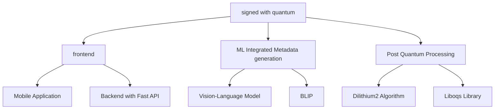

# Signed with Quantum

This project is a repository containing two sub-projects: a backend service for quantum-safe cryptographic signatures for signing the assets and a Mobile app which can be for accessing that service.

## About the Project

The Quantum Signers project is a quantum-safe cryptographic signature implementation. It utilizes post-quantum cryptography algorithms to sign and verify digital images, ensuring their authenticity and integrity in a post-quantum computing world, making your data Quantum safe

The project consists of two main components:

*   A **backend service** built with Python and FastAPI, which exposes an API for signing and verifying images using the Dilithium2 algorithm from the Open Quantum Safe (OQS) library.  You have to Deploy tha backend and configure the link before Using the Application more in the 

*   A **mobile application** built with React Native (Expo) that allows users to interact with the backend service to sign and verify images.

# Demo Link : https://drive.google.com/file/d/1e_XrOGWeFHnWrKKPAJSh8IHjk1l9ysde/view?usp=sharing

## Sub-parts of the project

*   **[Backend](./backend/README.md)**: A Python-based backend service that uses post-quantum cryptography to sign and verify digital images.
*   **[Frontend](./frontend/README.md)**: An Expo-based mobile application that interacts with the backend.

## Project Structure


## Global Setup

To set up and run this project, you will need to follow the setup instructions for each sub-project individually.
Further descriptions have been provided in the respective Readme.md Files
### 1. Backend Setup

Navigate to the `backend` directory and follow the instructions in its [README.md](./backend/README.md).

```bash
cd backend
# Follow the setup instructions in backend/README.md
```

### 2. Frontend Setup

Navigate to the `frontend` directory and follow the instructions in its [README.md](./frontend/README.md).

```bash
cd ../frontend
# Follow the setup instructions in frontend/README.md
```

Once both the backend and the mobile app are set up and running, they will be able to communicate with each other.

### Submissions 
Video Link  :  tbd 

